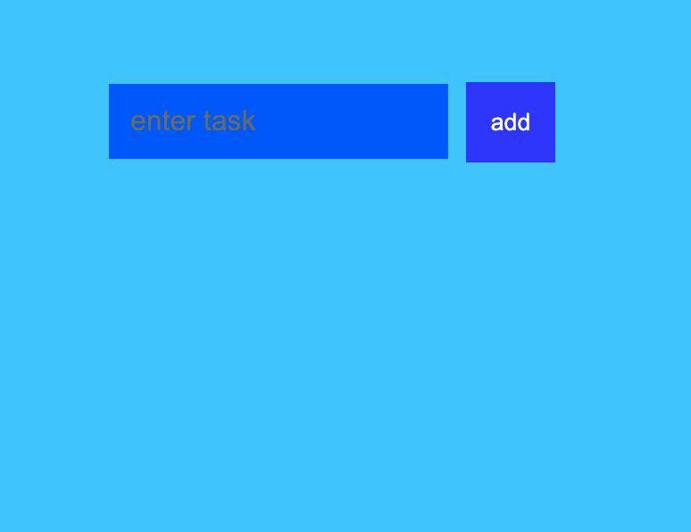
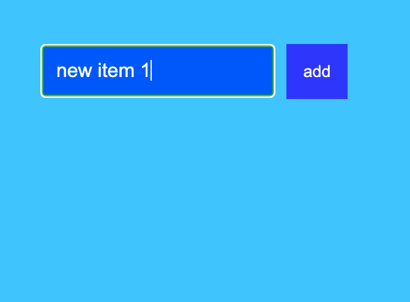
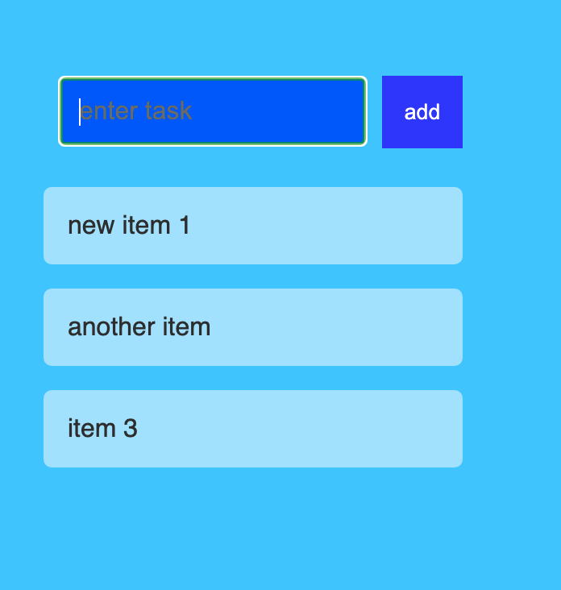
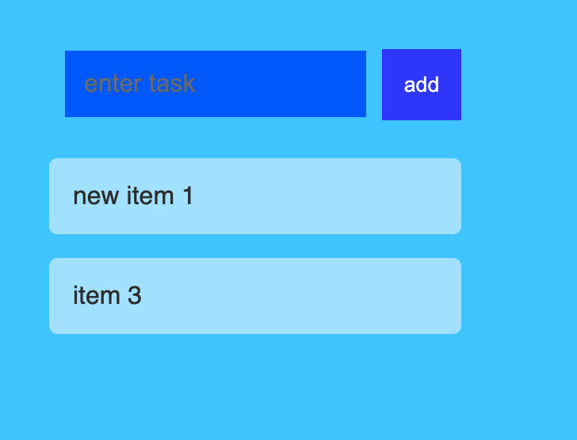

# Project Name 
Practice React Todo List 1

  ## Overview 
  This project is the first of some practice todo list apps to practice react

  ## Table of Contents:
  - [Screenshots_and_GIFs](#Screenshots_and_GIFs)
  - [Motivation](#Motivation)
  - [Installation](#Installation)
  - [How_to_use](#How_to_use)
  - [redits](#Credits)

 ## Screenshots_and_GIFs 
  -  
  - 
  -   
  - 
  -   
  - 
  
  ## Motivation
  Simply to practive basic react features. 

  ## Installation 
  - npm i sequelize express-handlebars mysql2 bcryptjs passport express

  ## How_to_use
  - run npm start
  use input text box to type in new item
  when item is added to page text box will clear
  now you can add another item OR
  click on item you want to delete and it will be removed

  ## Credits
 This was a react toolist walk through article and video created by Kirupa at https://www.kirupa.com/react/simple_todo_app_react.htm

  © Copyright 2020
